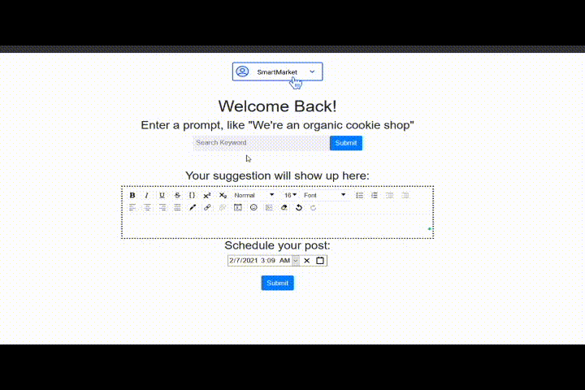

# Demo

# Implementation
* A Flask Backend, interfacing with a trained GPT-2 Model and a MongoDB databse.
* A GPT-2 Model trained on Google Collab, managed with GPT-2-Simple and deployed as an API endpoint.
* A threaded implementation of post scheduling, creating a persistent queue, where scheduled content is posted using the Facebook API in 1 hour intervals.
* A React Front-end built with the help of React-Bootstrap, Draft.js and Axios.

# Inspiration

Think about **your favourite small businesses**. Where'd you hear about them? A glowing review, social media, word of mouth? Now think about where you heard about many of the big-box stores you shop at. Odds are, you hear about them through their extensive marketing. Everything from their massive storefronts to their billboards. Small businesses **compete on the web**, 41% of small businesses rely on social media for marketing, yet many devote as **little as 2 hours a week** to marketing. Wouldn't it be nice, if they could constantly churn out marketing content, so everyone else can hear about them?

# What it does
SmartMarket gives small businesses the power to **automatically generate content** with Natural Language Processing, powered by GPT-2, and **automatically upload it to their social media at a specified time**. 

To use it, the user provides a short prompt, after which GPT-2 generates marketing content based off their prompt. The user can modify it as they wish, then schedule a post for any given time, and get back to focusing on what they do best.

# Challenges we ran into

The constant challenge of machine learning is finding data, and this project was no different. It took a lot of Kaggle digging, strategic Googling and synonym brainstorming to come up with a dataset that worked well enough, consisting of real estate and job advertisements. 

Then we had to actually train the model. GPT-2 is computationally intensive and works best on parallelized processors, such as GPU, something our computers lack. We decided to utilize Google Collab to train the model, a 5 hour waiting game in itself. Then, we saved the model and reloaded it on the server that was hosted on my machine. 

Our final challenge was scheduling posting. While the Facebook API made the posting part of the task easy, we had to figure out how to make posts at a given time. I ended up opting for the most scaleable and resilient solution, saving posts in a database which acts as a persistent queue, and checking for posts that need to be sent to Facebook every minute. This required multithreading, and in a production setting, we would choose to additionally delete every post after it is sent to prevent crowding the database and maintaining reliability. 

# Accomplishments that we're proud of

We have an NLP model that generates reasonably good content! I found this a feat in itself, given our complete lack of NLP knowledge and weak dataset, I'm happy to see how well our model performs. 

# What we learned

We had a real crash course in NLP, model selection, data mining and training models. I'm walking away knowing a ton more about NLP than I did before, and I hope to continue learning. I also implemented my first use of multi-threading, and I'm satisfied with the relatively low resource use of the entire solution due to the use of multi-threading. 

# What's next for SmartMarket

Integration with other social media sites, like Twitter and Instagram.
Mining better data to train an even better model.
Support for batch posting, multiple posts over multiple days with one request. 
Support for image upload with text posts. 